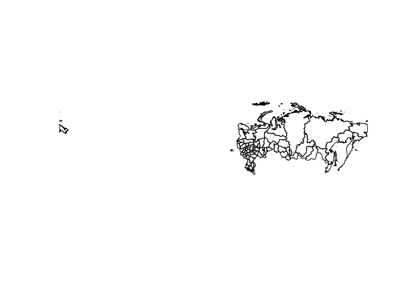
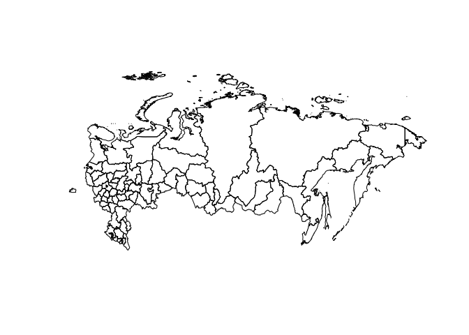
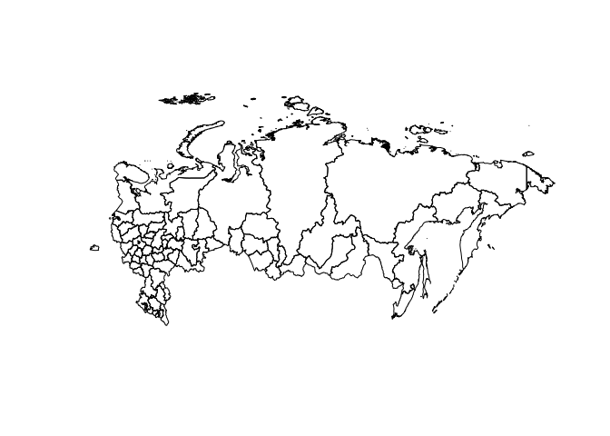

# Объединение полигонов для целей пространственного анализа

В этом коротком примере я показываю, как объединить между собой
несколько полигонов, в частности, объединить границы Архангельской
области и Ненецкого автоновного округа, а также Тюменской области с
Ханты-Мансийским и Ямало-Ненецким автономными округами. Это может
пригодиться при проведении пространственного анализа, т. к. бывают
показатели, которые не рассчитаны отдельно для автономных округов.

## Загрузка пакетов

Для начала установим и загрузим пакеты, необходимые для
пространственного анализа.

``` r
library(dplyr)        # манипуляции с данными и визуализация
library(geodata)      # для доступа к данным о границах
library(sf)           # манипуляции с пространственными объектами
```

## Пространственные данные

Для осуществления пространственного анализа нам для начала нужны
геоданные. Я буду использовать функцию из пакета `geodata` для доступа к
данным с сайта GADM: <https://gadm.org/data.html> версии 3.6. На самом
сайте есть более новые версии в разных форматах, но я привык к этой.
Подробнее о форматах: <https://gadm.org/formats.html>.

Загрузим геоданные о российских регионах (для уровня регионов указываем
`level = 1`):

``` r
rus_reg_gpkg <- geodata::gadm(country = 'RUS', level = 1, path = tempdir(), version = 3.6)
```

Перейдем к другому формату, чтобы можно было использовать возможности
пакета `sf`:

``` r
rus_reg_sf <- sf::st_as_sf(rus_reg_gpkg)
```

Теперь мы работаем с набором данных, в котором содержатся различные
пространственные данные. Колонки `NAME_1`, `NL_NAME_1` содержат названия
регионов на латинице и на русском соответственно. И те, и другие не
совсем соответствуют официальным названиям регионов РФ, но что-то нам
нужно будет использовать для объединения с экономическими данными по
регионам. Я для этого возьму колонку `NAME_1` для воспроизводимости в
международном контексте и лучшей читаемости иностранными коллегами.

Колонка `geometry` содержит координаты для построения мультиполигонов.
Эти данные позволяют строить карты и проводить пространственный анализ.

Из-за расположения территории России в двух полушариях карта выглядит не
очень корректно:

``` r
plot(rus_reg_sf$geometry)
```



Исправим проблему с координатной системой:

``` r
rus_reg_sf <- sf::st_transform(rus_reg_sf, crs = "+proj=longlat +lon_wrap=180")
```

Теперь получается адекватная карта:

``` r
plot(rus_reg_sf$geometry)
```



## 

## Объединение полигонов

Сначала создадим три списка, которые нам пригодяться для выбора
необходимых строк:

``` r
arkh_units <- c("Arkhangel'sk", "Nenets")
tyum_units <- c("Tyumen'", "Khanty-Mansiy", "Yamal-Nenets")
auto_units <- c("Nenets", "Khanty-Mansiy", "Yamal-Nenets")
```

Создадим пространственные наборы данных для Архангельской и Тюменской
областей и входящих в них автономных округов:

``` r
arkh_sf <- rus_reg_sf %>% dplyr::filter(NAME_1 %in% arkh_units)
tyum_sf <- rus_reg_sf %>% dplyr::filter(NAME_1 %in% tyum_units)
```

Объединим объекты внутри каждой из областей:

``` r
arkh_polyg <- arkh_sf %>% sf::st_union()
tyum_polyg <- tyum_sf %>% sf::st_union()
```

Удалим из изначального набора данные об автономных округах и заменим
полигоны для Архангельской и Тюменской областей на новые:

``` r
rus_reg_sf_80 <- rus_reg_sf %>% 
  dplyr::filter(!NAME_1 %in% auto_units) %>%
  dplyr::mutate(geometry = case_when(NAME_1 == "Arkhangel'sk" ~ arkh_polyg,
                                     NAME_1 == "Tyumen'" ~ tyum_polyg,
                                     .default = geometry))
```

Посмотрим, что получилось. Теперь автономные округа включены в состав
Архангельской и Тюменской областей, границы между ними стерты и они
рассматриваются как один пространственный полигон:

``` r
plot(rus_reg_sf_80$geometry)
```



## Сохранение данных

Сохраним новые данные в формате shp-файла:

``` r
dir.create("rus_reg_80")
rus_reg_sf_80 %>% sf::st_write("rus_reg_80/rus_reg_80.shp", append = FALSE)
```

Также сохраним данные о 83 и 80 регионах для дальнейшей работы в R:

``` r
save(rus_reg_sf, rus_reg_sf_80, file = "rus_reg_sf.RData")
```
